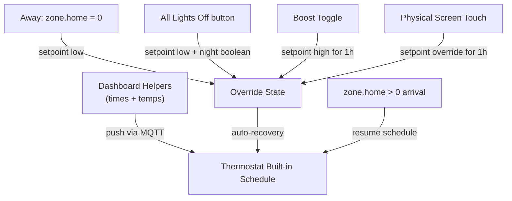

# Thermostat Dashboard & Automations Reference

This document describes a complete HA integration for controlling a smart
thermostat's built-in schedule from a dashboard, alongside smart overrides for
away mode, night mode, physical interaction, and a 1-hour boost button.

Applies to: Zigbee/Z-Wave/Tuya thermostats with a built-in weekly schedule
(e.g., Moes BHT-002, Hive, any `climate.*` entity that supports `schedule` or
`setpoint` modes via Zigbee2MQTT or similar).

---

## Architecture Overview

The thermostat's **built-in schedule engine** runs locally on the device.
Dashboard helpers define the schedule and push it via MQTT. Multiple automations
handle overrides (away, night, boost, physical) and always return the thermostat
to `schedule` mode when the override ends.



---

## Dashboard Helpers (`configuration.yaml`)

### Schedule Helpers

```yaml
input_datetime:
  thermostat_schedule_time_1:
    name: Thermostat Schedule Morning Time
    has_date: false
    has_time: true
  thermostat_schedule_time_2:
    name: Thermostat Schedule Day Time
    has_date: false
    has_time: true
  thermostat_schedule_time_3:
    name: Thermostat Schedule Evening Time
    has_date: false
    has_time: true
  thermostat_schedule_time_4:
    name: Thermostat Schedule Night Time
    has_date: false
    has_time: true

input_number:
  thermostat_schedule_temp_1:
    name: Thermostat Morning Temperature
    min: 15
    max: 30
    step: 1
    unit_of_measurement: °C
    icon: mdi:thermometer
  thermostat_schedule_temp_2:
    name: Thermostat Day Temperature
    min: 15
    max: 30
    step: 1
    unit_of_measurement: °C
    icon: mdi:thermometer
  thermostat_schedule_temp_3:
    name: Thermostat Evening Temperature
    min: 15
    max: 30
    step: 1
    unit_of_measurement: °C
    icon: mdi:thermometer
  thermostat_schedule_temp_4:
    name: Thermostat Night Temperature
    min: 15
    max: 30
    step: 1
    unit_of_measurement: °C
    icon: mdi:thermometer
  thermostat_night_away_temp:
    name: Thermostat Night/Away Temperature
    min: 15
    max: 25
    step: 1
    unit_of_measurement: °C
    icon: mdi:home-export-outline
```

### Override Toggles

```yaml
input_boolean:
  thermostat_boost_1h:
    name: Thermostat Boost 1h
    icon: mdi:fire
  thermostat_physical_override_fallback:
    name: Thermostat Physical Override Fallback
    icon: mdi:thermostat
    initial: true
  thermostat_night_mode:
    name: Thermostat Night Mode Active
    icon: mdi:weather-night
```

---

## Core Automations

### 1. Thermostat Schedule Sync

- **Trigger**: State changes on any schedule helper, HA start, or automation reload.
- **Action**: Compiles times and temps into a schedule string and pushes it via
  MQTT (or `climate.set_temperature` depending on your integration).
- **Note**: For Zigbee2MQTT, publish to `zigbee2mqtt/<device_friendly_name>/set`
  with the appropriate `schedule_monday` / `schedule_saturday` payload format.

### 2. Thermostat Away Mode

- **Trigger**: `zone.home` state changes to `0` (leave) or `>0` (arrive).
- **Action**:
  - On leave: Switch thermostat to low setpoint at `thermostat_night_away_temp`.
  - On arrive: Switch back to `schedule` mode.

### 3. House: All Lights Off (Thermostat Integration)

- **Trigger**: "All Lights Off" button press (physical or dashboard).
- **Action**: Set thermostat to low setpoint + activate `thermostat_night_mode`.

### 4. Thermostat Night/Away Recovery

- **Trigger**: `thermostat_night_mode` turns `on`.
- **Action**: Wait up to 4 hours. If house occupied after 4 hours, restore
  schedule mode. If nobody is home, wait for arrival before restoring.

### 5. Thermostat 1-Hour Boost

- **Trigger**: `thermostat_boost_1h` turns `on`.
- **Action**: Set high setpoint. Wait 1 hour, then restore schedule mode.
  Guard: check house is still occupied before restoring.

### 6. Thermostat Physical Manual Override (1-Hour Fallback)

- **Trigger**: Target temperature of the `climate.*` entity changes.
- **Guard Conditions**: Validate it is a physical interaction — check that no
  other override (boost, night/away) is active and house is occupied.
- **Action**: Wait 1 hour, then restore schedule mode. Multiple taps reset the timer.

---

## Interaction Matrix

| Automation | Sets Mode | Sets Temp | Cancels Boost? | Aware of Away? |
|---|---|---|---|---|
| Schedule Sync | — (pushes data) | — | No | No |
| Away Mode | setpoint/schedule | `night_away_temp` | ✅ Yes | Is the source |
| All Lights Off | setpoint | `night_away_temp` | ✅ Yes | Sets night boolean |
| Night/Away Recovery | schedule | — | No | Clears night boolean |
| Boost 1h | setpoint/schedule | high °C | Is the source | ✅ Checks zone |
| Physical Override | schedule | — | No | ✅ Checks booleans |

---

## How to Test

1. **Test Schedule Sync**: Change a temperature slider on the dashboard. Check
   the thermostat entity's `schedule_monday` attribute to confirm it updated.
2. **Test Boost**: Toggle the Boost switch. Confirm thermostat mode changes to
   `setpoint` and temperature rises.
3. **Test All Lights Off / Away**: Trigger the "All Lights Off" automation.
   Confirm `thermostat_night_mode` turns `on` and the thermostat drops to the
   away temperature.
4. **Test Auto-Return**: While in schedule mode, physically change the
   temperature on the wall screen. Wait 1 hour and confirm it reverts.

---

## Adaptation Notes

- **MQTT format**: The schedule string format varies by thermostat firmware.
  For many Tuya/Moes thermostats via Zigbee2MQTT, the format is
  `HH:MM/XX°C HH:MM/XX°C ...` for each time slot. Check your device's
  Zigbee2MQTT device page for the exact attribute name.
- **Weekend schedules**: Some thermostats support separate Saturday/Sunday
  schedules. Duplicate the `input_datetime` and `input_number` helpers for each
  day if needed.
- **`climate.set_temperature` vs MQTT**: If your thermostat exposes a standard
  HA `climate` entity, use `climate.set_temperature` instead of raw MQTT.
